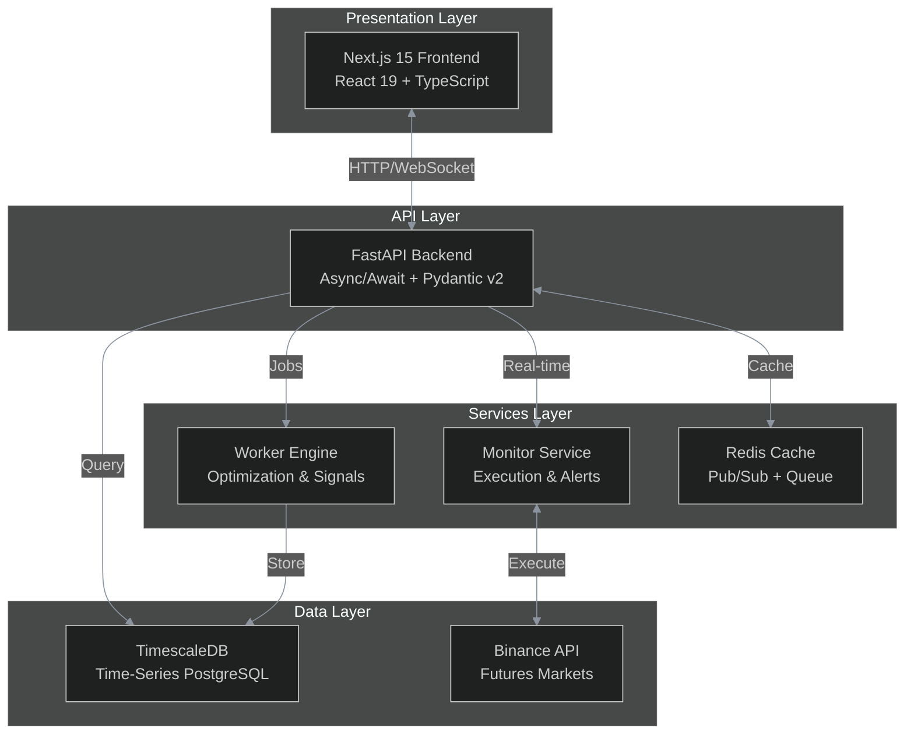

<div align="center">

<!-- Animated header effect with shields -->


<!-- Badges with modern styling -->
[](https://fastapi.tiangolo.com)
[](LICENSE.md)
[](https://python.org)
[](https://docker.com)

<!-- Tagline with styling -->
<h3>
  <samp>
    <b>Institutional-Grade Crypto Futures Trading Infrastructure</b><br>
    <span style="color:#8b949e">Monte Carlo Risk • Market Regime Detection • Algorithmic Execution</span>
  </samp>
</h3>

<!-- Animated separator -->


</div>

<!-- Philosophy Quote Box -->
<div align="center">

> ### 🏛️ The Sovereign Philosophy
> 
> *"In an era of centralized control and arbitrary platform restrictions,*  
> *financial sovereignty is a fundamental right.*  
> *Your servers. Your API keys. Your strategies. No compromises."*

</div>

<br>

<!-- Key Metrics Grid -->
<div align="center">

| ⚡ Sub-ms API | 🎲 10K Simulations | 🎯 4-State Regimes | 🛡️ Kill Switch |
|:------------:|:------------------:|:------------------:|:--------------:|
| Async FastAPI | Monte Carlo Risk | Trend/Range/Vol/Crisis | Auto-Circuit Breaker |

</div>

<br>

<!-- Screenshots Section with styled headers -->
## 📸 System Overview

<div align="center">

<!-- Dashboard -->
<table>
<tr>
<td width="50%">

<h3 align="center">📊 Command Center</h3>
<p align="center"><i>Real-time portfolio tracking with P&L analytics</i></p>

```
┌─────────────────────────────────────────┐
│  BTCUSDT  ▲ 2.4%    Portfolio: $12,450 │
│  ████████████████████░░░░░ +$345 today │
│                                         │
│  Positions    Trades      Regime       │
│  ─────────────────────────────────────  │
│  🟢 LONG      12         UPTREND       │
│  🔴 SHORT      8         VOLATILE      │
│                                         │
│  Risk Level: 🟡 MODERATE               │
└─────────────────────────────────────────┘
```

</td>
<td width="50%">

<h3 align="center">🎲 Risk Engine</h3>
<p align="center"><i>10,000-scenario Monte Carlo simulation</i></p>

```
┌─────────────────────────────────────────┐
│  Monte Carlo Simulation Results       │
│  ═══════════════════════════════════  │
│                                         │
│   VaR (95%):    -$234    ████░░░░░░   │
│   CVaR:         -$312    █████░░░░░   │
│   Max Drawdown: -15%     ████████░░   │
│                                         │
│   Win Rate:     62%      🟢            │
│   Expectancy:   +$45/trade              │
│                                         │
└─────────────────────────────────────────┘
```

</td>
</tr>
<tr>
<td width="50%">

<h3 align="center">🎯 Regime Analytics</h3>
<p align="center"><i>Market state classification with confidence</i></p>

```
┌─────────────────────────────────────────┐
│  Market Regime Detection                │
│  ═══════════════════════════════════    │
│                                         │
│  Current:    📈 UPTREND    87% conf     │
│  Previous:   📊 SIDEWAYS   → 2h ago    │
│                                         │
│  Volatility: ████████░░    HIGH (2.1%)  │
│  Trend Str:  ██████████   STRONG        │
│  Correlation: ████░░░░░░   LOW           │
│                                         │
│  Strategy:   TREND_FOLLOW enabled      │
└─────────────────────────────────────────┘
```

</td>
<td width="50%">

<h3 align="center">📈 Backtest Engine</h3>
<p align="center"><i>Walk-forward optimization with metrics</i></p>

```
┌─────────────────────────────────────────┐
│  Strategy: Dual_MA_Crossover v2.1       │
│  ═══════════════════════════════════════ │
│                                         │
│  Period:     2023-01 → 2024-12         │
│  Trades:     156 (62% win rate)         │
│  Return:     +127%     🟢              │
│  Max DD:     -12.3%                    │
│  Sharpe:     1.84                      │
│  Sortino:    2.41                      │
│                                         │
│  [✓] Out-of-sample validated            │
└─────────────────────────────────────────┘
```

</td>
</tr>
</table>

</div>

<br>

<!-- Architecture Section -->
## 🏗️ Architecture



<br>

<!-- Features Grid -->
## ⚡ Capabilities

<table>
<tr>
<td valign="top" width="33%">

### 🔥 Trading Engine
- **Binance Futures** (USDT-M & COIN-M)
- **Long/Short** with unified margin
- **Real-time WebSocket** feeds
- **Paper trading** mode
- **Testnet → Live** transition

</td>
<td valign="top" width="33%">

### 🎲 Risk Management
- **Monte Carlo** (10K+ scenarios)
- **VaR & CVaR** calculations
- **Drawdown** probability
- **Black swan** stress testing
- **Position heat** monitoring

</td>
<td valign="top" width="33%">

### 🎯 Market Intelligence
- **4-state regime** detection
- **Volatility** tracking
- **Trend strength** (ADX)
- **Regime-aware** selection
- **Correlation** analysis

</td>
</tr>
</table>

<br>

<!-- Safety Systems Highlight -->
<div align="center">

## 🛡️ Safety Systems

| System | Function | Trigger |
|:------:|:--------:|:-------:|
| **Kill Switch** | Emergency shutdown | Drawdown threshold breach |
| **Circuit Breakers** | Daily/weekly limits | Loss limit exceeded |
| **Pre-Trade Checks** | Risk validation | Every order |
| **Duplicate Detection** | Signal deduplication | Before execution |

</div>

<br>

<!-- Stack Section -->
## 🛠️ Technology Stack

<div align="center">

| Layer | Technology | Purpose |
|:-----:|:----------:|:-------:|
| Frontend |   | Dashboard UI |
| Backend |  | REST + WebSocket API |
| Database |  | Time-series data |
| Cache |  | Caching, pub/sub |
| Exchange | CCXT Pro | Binance integration |
| Data Science | Pandas 2.0+ / NumPy 1.24+ | Analytics |
| Deployment |  | Containerization |
| Security | Fernet / JWT | Encryption & auth |

</div>

<br>

<!-- Deployment Section -->
## 🚀 Deploy in Minutes

```bash
# 1. Clone repository (after purchase)
git clone https://github.com/peerapholpk-stack/sovereign-quant.git
cd sovereign-quant

# 2. Configure environment
cp .env.example .env
# Edit .env with your API keys

# 3. Launch infrastructure
docker-compose up -d

# 4. Access services
# Dashboard:    http://localhost:3000
# API Docs:     http://localhost:8000/docs
# Database:     localhost:5432
```

<br>

<!-- Requirements -->
## 📋 Requirements

<div align="center">

| Minimum | Recommended |
|:-------:|:-----------:|
| 2 vCPU | 4 vCPU |
| 4GB RAM | 8GB RAM |
| Docker 24.0+ | Docker 24.0+ |
| Binance account | Binance Futures enabled |

</div>

<br>

<!-- The Sovereign Difference -->
<div align="center">

## 💎 The Sovereign Difference

<table>
<tr>
<td align="center" width="25%">

### 🔓 **Open Source Core**
*Your code. Your servers. Your keys.*

</td>
<td align="center" width="25%">

### ⚡ **Performance**
*Sub-millisecond API response times*

</td>
<td align="center" width="25%">

### 🔬 **Scientific Rigor**
*10,000-scenario Monte Carlo validation*

</td>
<td align="center" width="25%">

### 🛡️ **Military-Grade Safety**
*Kill switches and circuit breakers*

</td>
</tr>
</table>

</div>

<br>

<!-- Perfect For Section -->
## 🎯 Perfect For

<div align="center">

| Who | Why |
|:---:|:---:|
| **Quant Developers** | Build custom algorithmic strategies |
| **Prop Traders** | Manage multiple accounts with unified risk |
| **Crypto Funds** | Deploy systematic strategies |
| **Individual Traders** | Automate proven manual strategies |
| **SaaS Founders** | White-label trading infrastructure |

</div>

<br>

<!-- Pricing Section -->
<div align="center">

## 💰 Pricing

### One-time payment. Lifetime access. No subscriptions.

<br>

<table>
<tr>
<td align="center" width="33%">

### 🥉 Starter
## $299

✅ Full source code  
✅ Single deployment  
✅ GitHub Issues support  
✅ 6 months updates

❌ Commercial use  
❌ Multiple deployments

</td>
<td align="center" width="33%" style="border:2px solid #58a6ff; border-radius:10px;">

### 🥈 Professional
## $599

✅ Everything in Starter  
✅ **Commercial use**  
✅ **3 deployments**  
✅ **Priority support**  
✅ 12 months updates  
✅ 1hr strategy consult

*Most Popular*

</td>
<td align="center" width="33%">

### 🥇 Enterprise
## $1,499

✅ Everything in Pro  
✅ **Unlimited deployments**  
✅ **White-label rights**  
✅ Private Telegram  
✅ 24 months updates  
✅ 4hrs custom dev  
✅ Onboarding call

</td>
</tr>
</table>

<br>

### 🎁 Limited Time Offer
**Use code `SOVEREIGN20` for 20% off** (first 50 customers)

</div>

<br>

<!-- CTA Section -->
<div align="center">

## 🛒 Get SovereignQuant

### Secure Payment Options

💳 Credit/Debit Card | ₿ BTC/ETH/USDT | 🏦 Bank Transfer (Enterprise)

<br>

**[👉 Purchase on Lemon Squeezy](YOUR-STORE-URL-HERE)**

<br>

*Or contact for custom licensing:* **peeraphol.ka@gmail.com**

</div>

<br>

<!-- Support Section -->
## 📞 Support

SovereignQuant is built for **self-reliant, capable developers**.

### ✅ What You Get
- **Repository Access** — Full source + updates
- **GitHub Issues** — Bug reports & infrastructure issues
- **GitHub Discussions** — Community knowledge sharing

### ❌ Out of Scope
- ❌ Strategy consulting or financial advice
- ❌ Coding tutoring or Python lessons
- ❌ Custom deployments or 1-on-1 calls

### Contact
For critical access issues: **peeraphol.ka@gmail.com** *(48-72h response)*

<br>

<!-- FAQ Accordion Style -->
<details>
<summary><h3 style="display:inline">❓ Frequently Asked Questions</h3></summary>

<br>

**Q: Is this a "black box" trading bot?**  
A: No. SovereignQuant is **infrastructure**, not signals. You bring your own strategies.

**Q: What exchanges are supported?**  
A: Currently **Binance Futures**. More coming in v1.1.

**Q: Do I need to know how to code?**  
A: Basic Python knowledge is recommended for strategy customization.

**Q: Can I run this on my home computer?**  
A: Yes, but a **VPS is recommended** for 24/7 operation.

**Q: Is there a refund policy?**  
A: Due to source code nature, **all sales are final**. Evaluate thoroughly before purchase.

**Q: Can I resell this?**  
A: Only with **Enterprise license** (white-label rights).

</details>

<br>

<!-- Roadmap -->
<details>
<summary><h3 style="display:inline">🚧 Development Roadmap</h3></summary>

<br>

### 2025 Q2 (Current: v1.0) ✅
- Binance Futures integration
- Monte Carlo risk engine
- Market regime detection

### 2025 Q3 (v1.1) 🔄
- Bybit Futures support
- ML predictions module
- Mobile app

### 2025 Q4 (v1.2) 🔄
- Strategy marketplace
- Multi-account portfolio
- Advanced options strategies

</details>

<br>

<!-- Footer -->
<div align="center">


### ⚠️ Disclaimer

**SovereignQuant is software, not financial advice.**

Cryptocurrency futures trading involves **substantial risk of loss**. Past performance does not guarantee future results. You are solely responsible for your trading decisions.

This repository contains **NO source code** — it is a promotional preview only. Source code delivered after purchase under commercial license.

<br>

*Built for those who refuse to outsource their financial destiny.*

**[⬆ Back to Top](#sovquant)**

</div>
